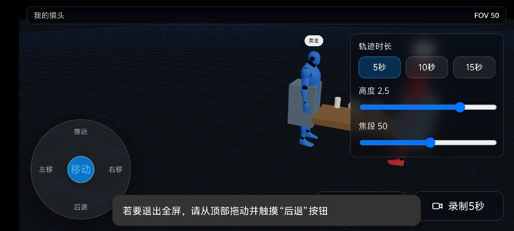
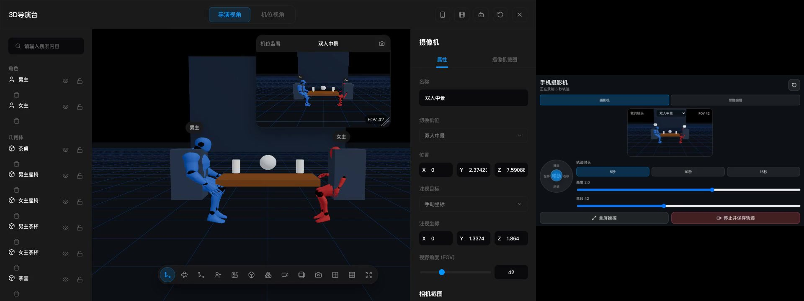
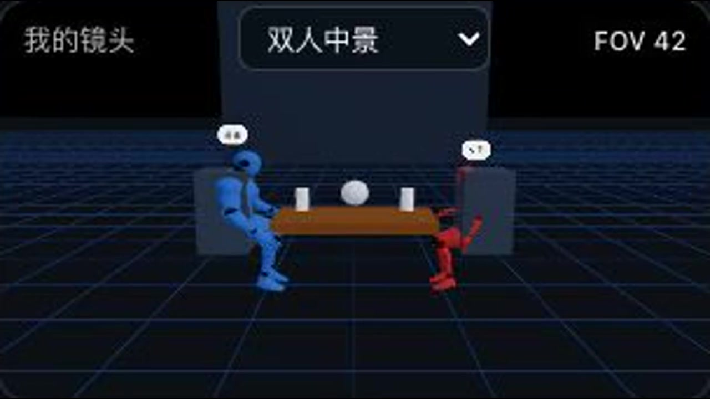
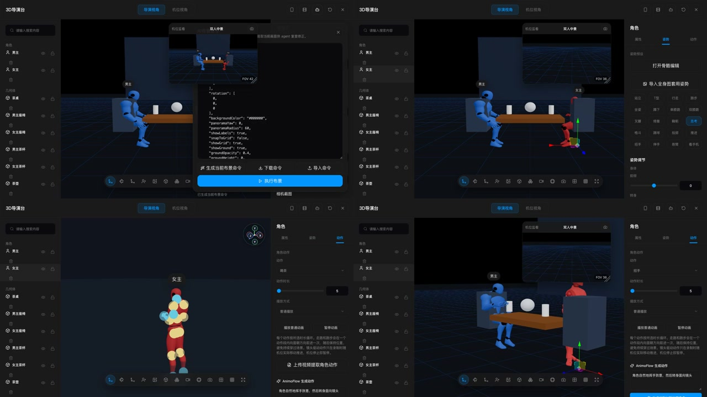

# AI 影视 3D 导演台 / AI 3D Director Desk

[中文](#中文) | [English](#english)

一个本地优先的 AI 影视预演与虚拟摄影工具：在电脑上快速搭建 3D 布景，让多台手机分别控制不同机位，并将实时机位监看直接录制为 MP4。

A local-first AI previs and virtual cinematography tool. Build 3D scenes on a computer, assign independent cameras to multiple phones, and record the live camera monitor directly to MP4.


<table>
  <tr>
    <td></td>
    <td></td>
  </tr>
</table>



## 功能演示 / Feature Demos

点击封面播放 MP4。视频分别展示手机操控镜头与电脑导演台同步、手机机位录制结果，以及 AI 布景、布景命令导入导出、快速摆姿和 AnimoFlow 提示词生成角色动画。

Click a poster to play the MP4. The demos cover synchronized phone camera control and desktop monitoring, the recorded phone-camera shot, AI scene building and scene-command round trips, fast character posing, and AnimoFlow prompt-to-animation.

### 手机操控与导演台同步 / Phone Control + Director Desk

[](https://github.com/femnn/ai-3d-director-desk/releases/download/v0.0.1/phone-camera-control.mp4)

[播放视频 / Play video](https://github.com/femnn/ai-3d-director-desk/releases/download/v0.0.1/phone-camera-control.mp4)

### 手机机位录制成片 / Recorded Phone-Camera Shot

[](https://github.com/femnn/ai-3d-director-desk/releases/download/v0.0.1/phone-recorded-shot.mp4)

[播放视频 / Play video](https://github.com/femnn/ai-3d-director-desk/releases/download/v0.0.1/phone-recorded-shot.mp4)

### AI 布景、角色动画与快速摆姿 / AI Scene, Animation + Fast Posing

[](https://github.com/femnn/ai-3d-director-desk/releases/download/v0.0.1/ai-scene-animation-pose.mp4)

[播放视频 / Play video](https://github.com/femnn/ai-3d-director-desk/releases/download/v0.0.1/ai-scene-animation-pose.mp4)

## 中文

### 特色功能

- **手机就是虚拟摄影机**：扫码加入、摇杆移动、滑动控制朝向、升降和变焦；每台手机独占自己的机位。
- **横屏全屏操控**：进入全屏时优先锁定系统横屏，不支持方向锁定的浏览器会自动使用横屏布局。
- **机位监看与视频录制**：手机和电脑显示同一实时机位画面，支持 5 / 10 / 15 秒轨迹录制与 MP4 导出。
- **角色姿势与动画**：提供循环动作、镜头移动驱动动作、视频动作提取、图片姿势提取、骨骼编辑和 AnimoFlow 文字动作入口。
- **AI 快速布景**：Agent 通过白名单 JSON 命令创建角色、道具、站位和机位，不执行任意脚本。
- **一键保存与恢复**：支持完整工程 JSON、可复用布景命令、导入模型、角色姿势和摄像机动画。
- **组合与物体动画**：手动组合道具，编辑关键帧和编号路径点，并让整体或子部件分别运动。
- **多人多机位**：多台手机同时加入时分别控制独立机位，机位不足时自动创建。

### 快速开始

#### 下载桌面版

在 GitHub 的 [Releases](https://github.com/femnn/ai-3d-director-desk/releases) 页面下载：

- macOS Apple Silicon：DMG 安装包或 ZIP 压缩包。
- Windows x64：Setup 安装版或 Portable 便携版。

#### macOS 本地启动器

双击项目目录中的 `启动3D导演台.command`。启动器会运行本地服务并自动打开导演台，使用期间不要关闭终端窗口。

#### 源码运行

```bash
npm install
npm run dev
```

电脑打开终端显示的 `Director desk` 地址。手机与电脑连接同一网络后，扫描导演台中的二维码即可加入。

### 基本流程

1. 在电脑端添加角色、道具和机位，或在 AI 布景面板导入结构化命令。
2. 手机扫码加入。多人加入时每台手机绑定一个独立机位，机位不足时自动创建。
3. 使用左侧摇杆移动，拖动监看画面改变镜头方向，并调整高度和焦段。
4. 选择 5、10 或 15 秒录制，保存摄像机轨迹及对应的实时机位视频。
5. 在摄像机动画列表回放、删除轨迹或导出 MP4。
6. 使用“导出工程”保存全部资产，或导出“布景命令”供 Agent 快速恢复和修改。

完整说明见 [中文使用指南](docs/USER_GUIDE.md)。
需要让其他 AI 生成可导入 JSON 时，直接使用 [导演台 JSON 生成指南](docs/AI_SCENE_SCRIPT_GUIDE.md)。

### Agent 布景接口

白名单工具包括：

- `get_scene`
- `apply_scene_script`
- `add_character` / `update_character`
- `add_camera` / `set_camera_view`
- `add_prop` / `delete_object`
- `add_group` / `update_prop`（父子层级、局部旋转轴和通用物体动画）
- `capture_shot` / `screenshot`
- `export_scene_script` / `import_scene_script`
- `export_character` / `import_character`
- `record_camera_animation` / `play_camera_animation`

布景命令使用固定 JSON schema，不接受任意 JavaScript。

`apply_scene_script` 支持递归 `groups[].children` 部件树，以及 `repeat`、`mirror`、`pathCopy`。几何体支持立方体、圆角盒、球体、半球、胶囊体、圆柱体、管道、圆盘、平面、楔形、环状体、圆锥和棱锥。任意组合或部件均可添加 5 / 10 / 15 秒的位置、旋转、缩放或路径动画。

### 致谢与来源

本项目以 [jiguang132/storyai-3d-director-desk](https://github.com/jiguang132/storyai-3d-director-desk) 为基础进行独立二次开发。感谢原作者 **jiguang132** 提供浏览器 3D 导演台的基础实现。

本项目增加并持续改造了手机虚拟摄影机、多人独立机位、实时监看与 MP4 录制、角色动画与骨骼编辑、Agent 快速布景、桌面程序和工程恢复等功能。原作者并未参与这些后续功能的开发或维护。项目继续遵循原仓库的 MIT License。

## English

### Highlights

- **Use a phone as a virtual camera**: join by QR code, move with a joystick, drag to aim, and adjust camera height and FOV. Each phone owns an independent camera.
- **Landscape fullscreen controls**: fullscreen mode requests landscape orientation and falls back to a responsive landscape layout when orientation lock is unavailable.
- **Live monitoring and MP4 recording**: the phone and desktop use the same live camera view, with 5, 10, and 15-second camera-path recording.
- **Character posing and animation**: looping presets, camera-motion-driven playback, video motion extraction, image pose extraction, direct rig editing, and an AnimoFlow text-to-motion entry point.
- **Agent-assisted scene building**: a local agent creates characters, props, blocking, and cameras through a strict JSON tool whitelist.
- **Save and restore**: export complete project JSON or reusable scene commands, including imported assets, edited poses, cameras, and camera animations.
- **Grouped prop animation**: group props manually, edit keyframes and numbered path points, and animate assemblies or child parts independently.
- **Multi-phone production**: multiple phones can join simultaneously and control separate cameras; missing cameras are created automatically.

### Quick Start

#### Download the desktop builds

Download the current packages from [GitHub Releases](https://github.com/femnn/ai-3d-director-desk/releases):

- macOS Apple Silicon: DMG installer or ZIP archive.
- Windows x64: Setup installer or Portable executable.

#### Run from source

```bash
npm install
npm run dev
```

Open the `Director desk` URL printed in the terminal. Connect phones to the same network and scan the QR code shown in the director desk.

#### Build desktop packages

```bash
npm run package:mac
npm run package:win
```

### Typical Workflow

1. Add characters, props, and cameras on the desktop, or import a structured agent scene command.
2. Scan the QR code from each phone. Every phone receives its own camera assignment.
3. Move with the left joystick, drag the monitor to aim, and adjust height and FOV.
4. Record a 5, 10, or 15-second shot. The camera path and the matching live monitor video are saved together.
5. Replay or delete camera animations and export the recorded shot as MP4.
6. Export a complete project for asset-safe backup, or export scene commands for agent-assisted revisions.

See the [English User Guide](docs/USER_GUIDE_EN.md) for detailed instructions.

### Credits and Origin

This project is an independently developed derivative of [jiguang132/storyai-3d-director-desk](https://github.com/jiguang132/storyai-3d-director-desk). Thanks to **jiguang132** for the original browser-based 3D director desk foundation.

This fork adds and maintains phone-controlled virtual cameras, isolated multi-phone camera ownership, live monitor MP4 recording, character animation and rig editing, agent-assisted scene building, desktop packaging, and project recovery. The original author did not participate in the development or maintenance of these later additions. The project retains the upstream MIT License.

## Technology

- React 18, TypeScript, and Vite
- Three.js, React Three Fiber, and Drei
- Zustand scene state
- WebSocket multi-phone controls
- MediaRecorder and FFmpeg MP4 packaging
- Electron and electron-builder
- Vitest

## Development

```bash
npm test
npm run build
```

The GitHub Actions desktop workflow can build Windows and macOS packages on native runners.

## Privacy

- The director desk, phone controls, and agent bridge can run entirely on a local network.
- Project files and scene commands are uploaded only when the user explicitly exports or shares them.
- Phone control state is transmitted through the current local WebSocket session.
- AnimoFlow requests follow the privacy and deployment settings of the configured AnimoFlow service.

## License

[MIT](LICENSE)
